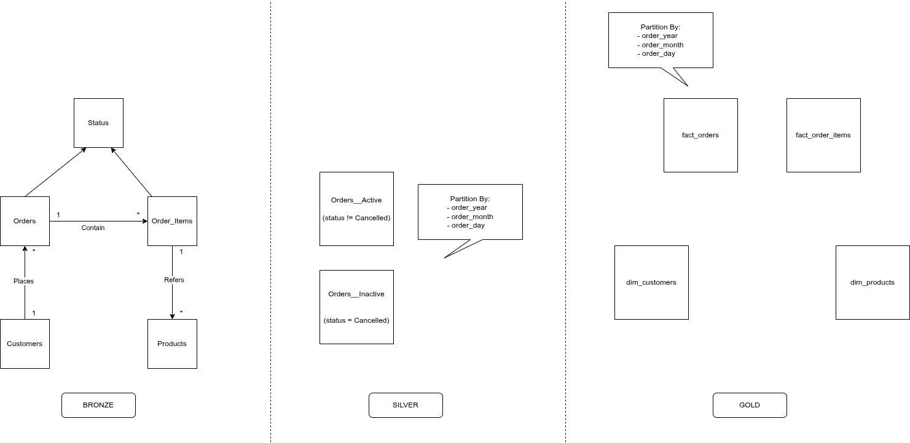

# olist_dataset_databricks
- Products, Customers and Orders management in Databricks based on Kaggle dataset (https://www.kaggle.com/datasets/olistbr/brazilian-ecommerce)
- Refer enhanced dataset for following task in /raw.
- Two types of datasets: `master_data` (good for *SCD Type 1*) and `transactions_data` (good for *SCD Type 2*). The same structure is uploaded to Databricks volume: `workspace.olist_raw`

----

# Architecture

----

## Task:
Design a data model for this scenario: Customers place orders. Each order will have multiple line items for different products, quantities, and statuses. When the complete order is delivered, it is marked as Completed. Also, track the status at the item level.

### Task 1:
Create a model for the above system and define the entity-relationship between the objects.

### Task 2:
Provide queries to find the most sold product in the last month.

### Additional Instructions:
- Design the data model and create a logical architecture for it.
- Build a SQL query for the "most sold product in the last month" (Please be prepared to explain your query during the interview).
